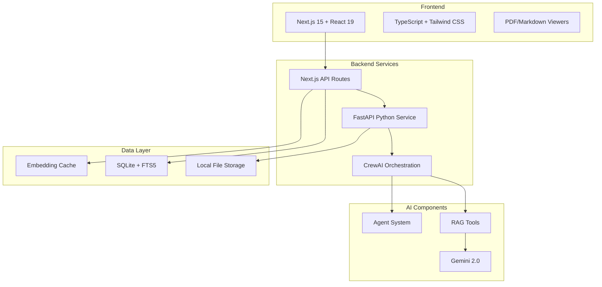

# 🧠 Gyst - Your AI-Powered Knowledge Brain

<div align="center">


[](https://nextjs.org/)
[](https://fastapi.tiangolo.com/)
[](https://crewai.com/)
[](https://www.typescriptlang.org/)
[](LICENSE)

**Transform your documents into an intelligent knowledge network with AI-powered analysis, smart tagging, and conversational search.**

[Features](#-features) • [Demo](#-demo) • [Installation](#-installation) • [Architecture](#-architecture) • [Documentation](#-documentation) • [Team](#-team)

</div>

---

## 🎯 Overview

Gyst is an AI-native document management system that acts as an intelligent knowledge base for teams. By leveraging cutting-edge AI technologies including CrewAI, RAG (Retrieval-Augmented Generation), and advanced NLP, Gyst transforms static documents into a dynamic, searchable, and conversational knowledge network.

### 🌟 Key Highlights

- **🤖 Multi-Agent AI System** - Specialized AI agents collaborate to analyze, tag, and understand your documents
- **🏷️ Automatic Smart Tagging** - AI-powered document analysis with intelligent tag generation
- **💬 Conversational Search** - Chat with your documents using natural language
- **🔍 Semantic Search** - Find documents based on meaning, not just keywords
- **🔒 Enterprise Security** - Role-based access control with organizational data isolation
- **⚡ High Performance** - Optimized with caching, streaming, and efficient indexing

## ✨ Features

### 📄 Document Management
- **Multi-format Support** - PDF, DOCX, TXT, Markdown with dedicated viewers
- **Automatic Processing** - Upload and instantly get AI-generated tags and insights
- **Smart Organization** - Tag-based relationships and semantic clustering
- **Full-text Search** - Lightning-fast search with SQLite FTS5

### 🤖 AI Intelligence
- **CrewAI Integration** - Multiple specialized agents working together:
  - Document Analysis Expert
  - Tag Generation Specialist
  - Context Analyzer
  - Chat Assistant
- **RAG-Powered Insights** - Deep document understanding using state-of-the-art retrieval
- **Conversation Memory** - Maintains context across chat sessions
- **Agent Transparency** - See how AI agents think and collaborate

### 💬 AI Chat Interface
- **Natural Language Queries** - Ask questions in plain English
- **Multi-Document Analysis** - Get insights across your entire knowledge base
- **Source Attribution** - Every answer linked to source documents
- **Follow-up Suggestions** - Intelligent conversation flow

### 🔐 Security & Access Control
- **Role-Based Access** - Admin and User roles with different permissions
- **Organization Isolation** - Complete data separation between organizations
- **SSO Support** - Google and GitHub authentication
- **Secure File Storage** - Encrypted local storage with access controls

### 🚀 Performance Features
- **Enhanced RAG System** - Smart chunking with 40-70% performance improvement
- **Intelligent Caching** - Hybrid memory/persistent storage for embeddings
- **Circuit Breakers** - Graceful degradation under load
- **Streaming Responses** - Real-time document serving and chat

## 📸 Screenshots

<div align="center">

### Dashboard Overview


### AI Chat Interface


### Document Viewer


</div>

## 🏗️ Architecture

Gyst uses a modern two-tier architecture optimized for AI workloads:



### Tech Stack

#### Frontend
- **Framework**: Next.js 15 with App Router
- **Language**: TypeScript 5.0
- **Styling**: Tailwind CSS + shadcn/ui
- **Auth**: NextAuth.js v5
- **Components**: React 19 with Server Components

#### Backend
- **API**: Next.js API Routes + FastAPI
- **AI Framework**: CrewAI with custom agents
- **LLM**: Google Gemini 2.0 Flash
- **Search**: SQLite FTS5
- **Caching**: Hybrid embedding cache

#### Infrastructure
- **Database**: SQLite with intelligent indexing
- **File Storage**: Local filesystem with hashed names
- **Session**: JWT with role management
- **Monitoring**: Health checks and metrics

## 🚀 Installation

### Prerequisites

- Node.js 18+ and npm/yarn
- Python 3.11+
- SQLite 3.35+ (with FTS5 support)
- Google Gemini API key

### Quick Start

1. **Clone the repository**
```bash
git clone https://github.com/maurograndaoramos/Gyst.git
cd Gyst
```

2. **Install Frontend Dependencies**
```bash
cd frontend
npm install
# or
yarn install
```

3. **Install Backend Dependencies**
```bash
cd ../backend
pip install -e .
```

4. **Environment Setup**

Create `.env` files in both frontend and backend directories:

**Frontend `.env.local`:**
```env
# Authentication
NEXTAUTH_URL=http://localhost:3000
NEXTAUTH_SECRET=your-secret-here

# OAuth Providers
GOOGLE_CLIENT_ID=your-google-client-id
GOOGLE_CLIENT_SECRET=your-google-client-secret
GITHUB_CLIENT_ID=your-github-client-id
GITHUB_CLIENT_SECRET=your-github-client-secret

# API Configuration
NEXT_PUBLIC_API_URL=http://localhost:8000
```

**Backend `.env`:**
```env
# Google Gemini API
GEMINI_API_KEY=your-gemini-api-key

# Server Configuration
HOST=0.0.0.0
PORT=8000
DEBUG=false

# File Storage
UPLOAD_BASE_DIR=./uploads
MAX_FILE_SIZE_MB=10

# Enhanced RAG Configuration
ENABLE_ENHANCED_RAG=true
ENABLE_SEMANTIC_SCORING=true
EMBEDDING_CACHE_DB_PATH=./data/embedding_cache.db

# Performance Settings
MAX_ANALYSIS_TIME_SECONDS=120
CIRCUIT_BREAKER_FAILURE_THRESHOLD=5
```

5. **Database Setup**
```bash
cd frontend
npm run db:migrate
# or
yarn db:migrate
```

6. **Start the Services**

Terminal 1 - Frontend:
```bash
cd frontend
npm run dev
# or
yarn dev
```

Terminal 2 - Backend:
```bash
cd backend
python main.py
```

Access the application at `http://localhost:3000`

## 📖 Usage

### Getting Started

1. **Sign Up/Login**
   - Use Google or GitHub SSO
   - First-time users will be prompted to create an organization

2. **Upload Documents** (Admin only)
   - Click the upload button in the dashboard
   - Select PDF, DOCX, TXT, or Markdown files
   - AI will automatically analyze and tag documents

3. **Search & Browse**
   - Use the search bar for full-text search
   - Filter by AI-generated tags
   - Click documents to view content

4. **Chat with AI**
   - Open the chat panel
   - Ask questions about your documents
   - Get answers with source citations

### User Roles

- **Admin**: Can upload documents, view all content, use AI features
- **User**: Can view documents, search, and use AI features (no upload)

## 🔌 API Documentation

### REST Endpoints

#### Document Management
- `POST /api/documents/upload` - Upload new documents (Admin only)
- `GET /api/documents` - List organization documents
- `GET /api/documents/[id]/content` - Retrieve document content
- `POST /api/documents/analyze` - Trigger AI analysis

#### Search
- `GET /api/search` - Full-text search with filters
- `GET /api/search/suggest` - Search suggestions

#### Chat
- `POST /api/chat` - Send message to AI
- `GET /api/chat/conversations/[id]` - Get conversation history

#### Health & Monitoring
- `GET /health` - Application health check
- `GET /api/circuit-breakers` - Circuit breaker status

### WebSocket Events

- `chat:message` - Real-time chat messages
- `analysis:progress` - Document analysis updates

## 🧪 Testing

Run the test suites:

```bash
# Frontend tests
cd frontend
npm test

# Backend tests
cd backend
pytest

# E2E tests
npm run test:e2e
```

## 🤝 Contributing

We welcome contributions! Please see our [Contributing Guidelines](CONTRIBUTING.md) for details.

### Development Workflow

1. Fork the repository
2. Create a feature branch (`git checkout -b feature/amazing-feature`)
3. Commit your changes (`git commit -m 'Add amazing feature'`)
4. Push to the branch (`git push origin feature/amazing-feature`)
5. Open a Pull Request

## 📚 Documentation

### Core Components

- [Enhanced RAG System](backend/memorybank/implementations/backend/ENHANCED_RAG_SYSTEM_DOCS.md)
- [Chat Implementation](backend/memorybank/implementations/backend/CHAT_ENDPOINT_IMPLEMENTATION_DOCS.md)
- [Search Implementation](frontend/memorybank/implementations/frontend/SEARCH_DOCUMENTS_IMPLEMENTATION_DOCS.md)
- [Error Handling](backend/memorybank/implementations/backend/ERROR_HANDLING_API_DOCS.md)

### Architecture Guides

- [System Architecture](docs/architecture-overview.pdf)
- [Data Flows](docs/data-flows.pdf)
- [API Reference](docs/api-reference.md)

## 🎯 Roadmap

### Current Status: MVP Complete ✅

### Upcoming Features

- [ ] Real-time collaboration
- [ ] Advanced analytics dashboard
- [ ] Mobile applications
- [ ] Multi-language support
- [ ] Cloud storage integration
- [ ] Advanced permission system

## 👥 Team

<table>
  <tr>
    <td align="center">
      <a href="https://github.com/maurograndaoramos">
        
        <br />
        <sub><b>Mauro Ramos</b></sub>
      </a>
      <br />
      <sub>Team Lead & Fullstack</sub>
    </td>
    <td align="center">
      <a href="https://github.com/CodeZobac">
        
        <br />
        <sub><b>Afonso Caboz</b></sub>
      </a>
      <br />
      <sub>Fullstack Developer</sub>
    </td>
    <td align="center">
      <a href="https://github.com/raphaelmatiaz">
        
        <br />
        <sub><b>Rafael Matias</b></sub>
      </a>
      <br />
      <sub>Frontend Developer</sub>
    </td>
  </tr>
</table>

### Project Details

- **Course**: Programação Web - Final Project
- **Institution**: ETIC_Algarve
- **Duration**: 4 weeks (MVP)
- **Status**: ✅ Complete

## 📄 License

This project is licensed under the MIT License - see the [LICENSE](LICENSE) file for details.

## 🙏 Acknowledgments

- ETIC_Algarve for the opportunity
- CrewAI team for the amazing framework
- Google for Gemini API access
- All open-source contributors

---

<div align="center">

**Built with ❤️ by Team Gyst**

[Report Bug](https://github.com/maurograndaoramos/Gyst/issues) • [Request Feature](https://github.com/maurograndaoramos/Gyst/issues)

</div>