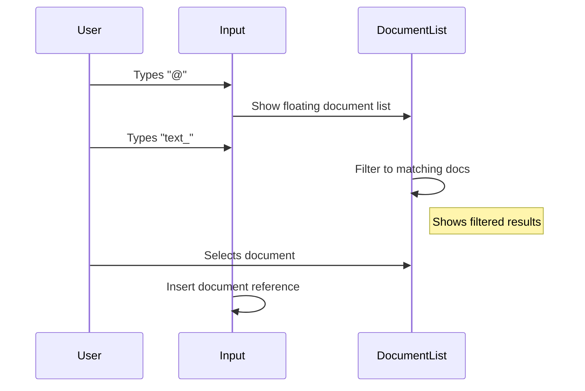
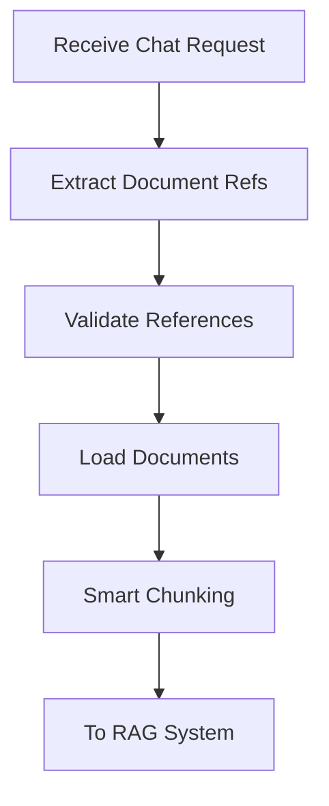
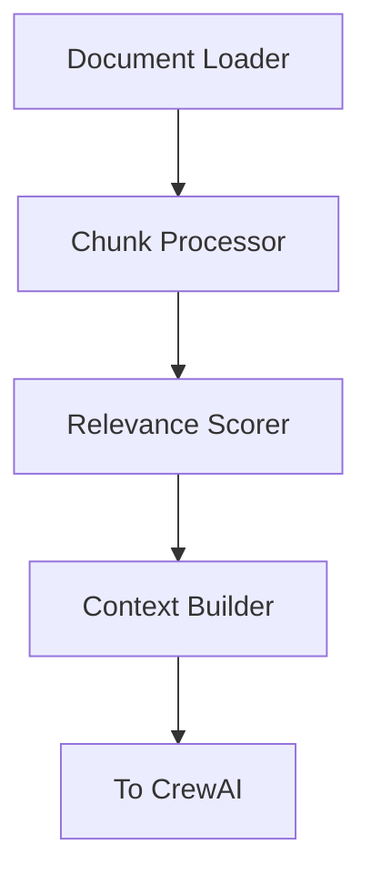
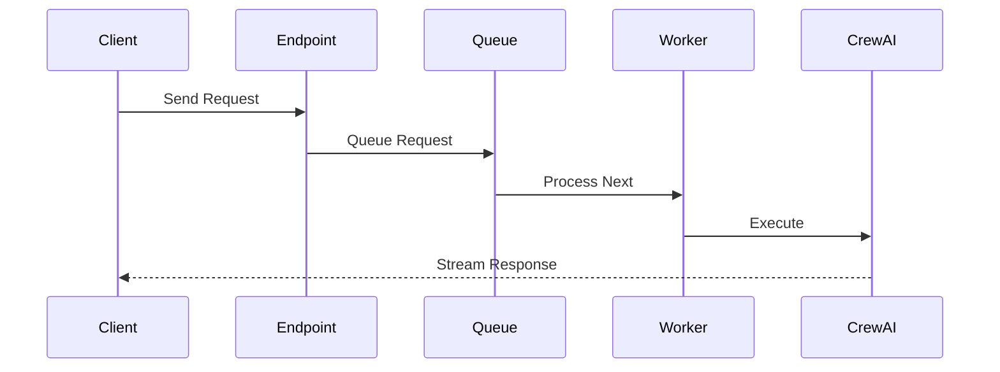

# Chat Endpoint Implementation Plan

## Overview

Implementation plan for the chat API endpoint with document context support and @ mention functionality.

## Phase 1: Frontend Document Selection System

### Document Mention Interface


### Components to Implement

1. **Enhanced Chat Input**
   - @ mention trigger detection
   - Document reference formatting
   - Message composition tracking
   - Reference validation

2. **Document Suggestion Component**
   ```typescript
   interface DocumentSuggestion {
     id: string;
     name: string;
     type: string;
     lastModified: Date;
   }
   
   interface SuggestionState {
     isOpen: boolean;
     filter: string;
     suggestions: DocumentSuggestion[];
   }
   ```

3. **Real-time Filtering System**
   - Debounced input handling
   - Fuzzy search implementation
   - Result ranking and sorting
   - Performance optimization for large lists

4. **Document Reference Handler**
   ```typescript
   interface DocumentReference {
     type: 'document';
     id: string;
     name: string;
     position: [number, number]; // Start and end positions in text
   }
   ```

### Frontend-Backend Integration

1. **API Endpoints**
   ```typescript
   // GET /api/documents/suggest?query=text_
   interface SuggestResponse {
     suggestions: DocumentSuggestion[];
     hasMore: boolean;
   }
   
   // POST /api/chat
   interface ChatRequest {
     message: string;
     documentRefs: DocumentReference[];
     conversationId?: string;
   }
   ```

2. **State Management**
   - Document suggestion cache
   - Recent/frequent documents
   - User selection history

## Phase 2: Backend Document Resolution System

### Document Processing Flow


### Components to Implement

1. **Reference Extractor**
   ```python
   class DocumentReferenceExtractor:
       async def extract_references(self, message: str) -> List[DocumentReference]:
           # Extract @[name](id) patterns
           # Validate reference format
           # Return structured references
   ```

2. **Document Resolver**
   ```python
   class DocumentResolver:
       async def resolve_references(
           self,
           refs: List[DocumentReference],
           org_id: str
       ) -> List[DocumentPath]:
           # Convert reference IDs to full paths
           # Verify file existence
           # Handle access permissions
   ```

3. **Document Loader**
   ```python
   class DocumentLoader:
       async def load_documents(
           self,
           paths: List[DocumentPath]
       ) -> List[ProcessedDocument]:
           # Load document contents
           # Apply smart chunking
           # Prepare for RAG system
   ```

## Phase 3: Enhanced RAG Integration

### RAG Processing Flow


### Components to Implement

1. **Smart Chunk Processor**
   - Content-aware chunking
   - Semantic boundary preservation
   - Metadata enrichment

2. **Multi-Factor Scorer**
   - Tag-based similarity (40%)
   - Semantic relevance (30%)
   - Content quality (20%)
   - Structure & freshness (10%)

3. **Context Builder**
   - Token window management
   - Priority-based selection
   - Context compression

## Phase 4: Request Processing Pipeline

### Request Flow


### Components to Implement

1. **Request Queue**
   ```python
   class RequestQueue:
       def __init__(self, max_concurrent: int = 3):
           self.queue = asyncio.Queue()
           self.processing = set()
           
       async def add_request(self, request: ChatRequest):
           # Add to queue
           # Handle backpressure
           
       async def process_next(self):
           # Process queue
           # Manage timeouts
           # Handle failures
   ```

2. **Circuit Breaker**
   ```python
   class ChatCircuitBreaker:
       def __init__(self, config: CircuitBreakerConfig):
           self.failures = 0
           self.config = config
           
       async def execute(self, func: Callable):
           # Implement circuit breaker pattern
           # Handle timeouts
           # Manage failure states
   ```

3. **Response Streamer**
   ```python
   class ResponseStreamer:
       async def stream_response(
           self,
           chat_response: AsyncIterator[str]
       ) -> AsyncGenerator[str, None]:
           # Stream chunks
           # Handle disconnects
           # Manage timeouts
   ```

## Phase 5: Integration & Testing

### Test Strategy

1. **Unit Tests**
   - Document reference parsing
   - Queue management
   - Circuit breaker behavior
   - Streaming functionality

2. **Integration Tests**
   - End-to-end request flow
   - Document resolution
   - RAG processing
   - Response streaming

3. **Performance Tests**
   - Concurrent request handling
   - Memory usage patterns
   - Response time metrics
   - Queue behavior under load

### Monitoring & Metrics

1. **Key Metrics**
   - Request queue length
   - Processing times
   - Cache hit rates
   - Error rates
   - Circuit breaker status

2. **Health Checks**
   - Queue health
   - System resource usage
   - Component status
   - Error patterns

## Configuration

### Session Storage
```python
ConversationMemoryConfig(
    max_context_tokens=32000,
    relevance_decay_factor=0.95,
    summary_threshold=20,
    topic_similarity_threshold=0.7,
    memory_compression_ratio=0.3,
    temporal_decay_hours=24.0
)
```

### Circuit Breaker
```python
CircuitBreakerConfig(
    failure_threshold=3,
    recovery_timeout=30,
    success_threshold=2,
    timeout_seconds=30
)
```

### Queue Configuration
```python
QueueConfig(
    max_concurrent=3,
    max_queue_size=100,
    request_timeout=30,
    backoff_factor=1.5
)
```

## Implementation Schedule

1. **Week 1: Frontend**
   - Enhanced chat input
   - Document suggestion system
   - Real-time filtering
   - Reference handling

2. **Week 2: Backend Core**
   - Reference resolution
   - Document loading
   - RAG integration
   - Basic queue setup

3. **Week 3: Processing Pipeline**
   - Full queue implementation
   - Circuit breaker
   - Streaming support
   - Error handling

4. **Week 4: Testing & Optimization**
   - Unit tests
   - Integration tests
   - Performance optimization
   - Documentation

## Success Criteria

1. **Functional Requirements**
   - ✓ @ mention functionality works smoothly
   - ✓ Document suggestions filter correctly
   - ✓ References resolve accurately
   - ✓ RAG system processes documents effectively
   - ✓ Responses stream in real-time

2. **Performance Requirements**
   - < 100ms for document suggestions
   - < 30s total processing time
   - < 1s queue wait time (95th percentile)
   - < 1% error rate

3. **Resource Requirements**
   - < 2GB memory usage
   - < 50% CPU utilization
   - < 100MB/s network usage
